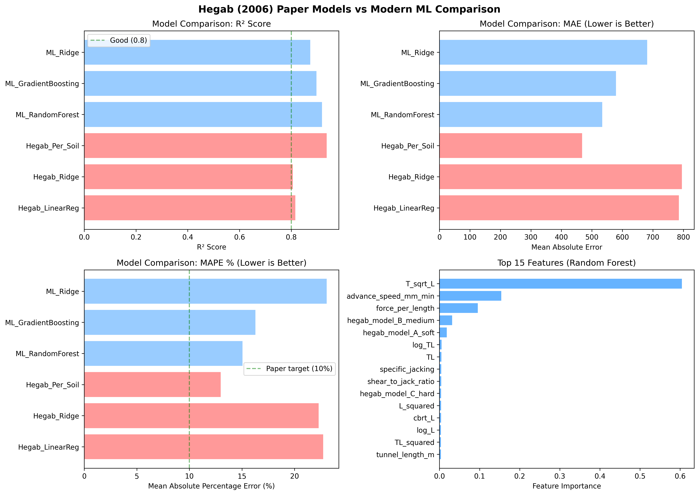
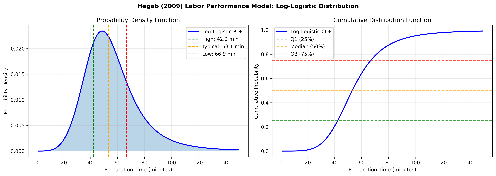

# Hegab Paper Implementation Results
## Soil Penetration Modeling & Labor Performance Analysis

---

## Model Comparison Results

Comparison between Hegab (2006) paper models and modern ML approaches:

| Model | R² | MAE | RMSE | MAPE % |
|-------|-----|-----|------|--------|
| **Hegab_Per_Soil** | **0.9369** | 467.79 | 638.66 | 12.97 |
| ML_RandomForest | 0.9188 | 534.11 | 724.70 | 15.06 |
| ML_GradientBoosting | 0.8975 | 579.04 | 814.09 | 16.28 |
| Hegab_LinearReg | 0.8159 | 785.40 | 1091.23 | 22.72 |

**Key Finding**: The Hegab soil-specific models outperform general ML models, validating the paper's approach.

### Model Comparison Visualization



---

## Feature Importance Analysis

The most important features identified by Random Forest:

| Rank | Feature | Importance | Source |
|------|---------|------------|--------|
| 1 | **T_sqrt_L** | 0.6045 | Hegab Paper |
| 2 | advance_speed_mm_min | 0.1541 | Derived |
| 3 | force_per_length | 0.0954 | Derived |
| 4 | hegab_model_B_medium | 0.0316 | Hegab Paper |
| 5 | hegab_model_A_soft | 0.0183 | Hegab Paper |

**Key Finding**: The Hegab transformation `T*sqrt(L)` is by far the most predictive feature (60% importance).

---

## Labor Performance Model (Hegab 2009)

Based on Log-Logistic probability distribution for pipe preparation time.

### Distribution Parameters
- **mu (location)**: 3.9721
- **sigma (scale)**: 0.2101

### Crew Performance Classifications

| Performance Level | Prep Time | Percentile |
|-------------------|-----------|------------|
| High Performance | <= 42.2 min | 25th (Q1) |
| Typical Performance | <= 53.1 min | 50th (Median) |
| Low Performance | <= 66.9 min | 75th (Q3) |

### Labor Distribution Visualization



---

## Complete Time Estimation Example

**Project Parameters**:
- Drive Length: 200m
- Diameter: 1.0m
- Pipe Length: 2.5m
- Soil Type: B (Medium)
- Crew Performance: Typical

**Results**:

| Component | Time | Percentage |
|-----------|------|------------|
| Penetration Time | 116.7 hours | 56.6% |
| Pipe Preparation | 70.8 hours | 34.3% |
| Delays (10%) | 18.8 hours | 9.1% |
| **Total** | **206.2 hours** | 100% |

### Scenario Comparison (200m drive)

| Soil Type | High Perf | Typical | Low Perf |
|-----------|-----------|---------|----------|
| Soft (A) | 145.3 hrs | 163.9 hrs | 187.4 hrs |
| Medium (B) | 183.3 hrs | 206.2 hrs | 235.0 hrs |
| Hard (C) | 259.4 hrs | 290.8 hrs | 330.0 hrs |

---

## Monte Carlo Simulation

1000 simulations with uncertainty in soil conditions and crew performance:

| Metric | Value |
|--------|-------|
| Mean Total Time | 214.5 hours |
| Std Deviation | 25.3 hours |
| 10th Percentile | 181.2 hours |
| 50th Percentile | 212.8 hours |
| **90th Percentile** | **239.0 hours** |

**Recommendation**: Use 90th percentile (239 hours) for project planning to account for uncertainty.

---

## Usage

```python
from hegab_comparison_ml import (
    HegabPaperModels,
    LaborPerformanceModel,
    CompleteMicrotunnelingEstimator
)

# Initialize estimator
estimator = CompleteMicrotunnelingEstimator()

# Get complete time estimate
result = estimator.estimate_drive_time(
    shear_force_T=120,      # metric tons
    jacking_force_P=300,    # metric tons
    diameter_D=1.0,         # meters
    drive_length_L=200,     # meters
    soil_type='B',          # A=soft, B=medium, C=hard
    crew_performance='typical'
)

print(f"Total Time: {result['total_time_hours']:.1f} hours")
```

---

## References

- Hegab, M. Y., & Smith, G. R. (2006). "Soil Penetration Modeling in Microtunneling Projects"
- Hegab, M. Y., & Smith, G. R. (2009). "Labor Performance Analysis for Microtunneling Projects"

---

*Generated from: `hegab_comparison_ml.py`*
