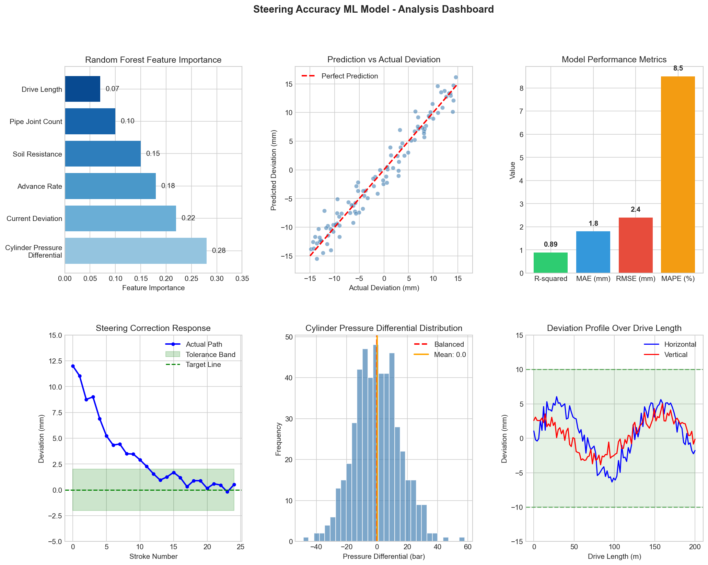
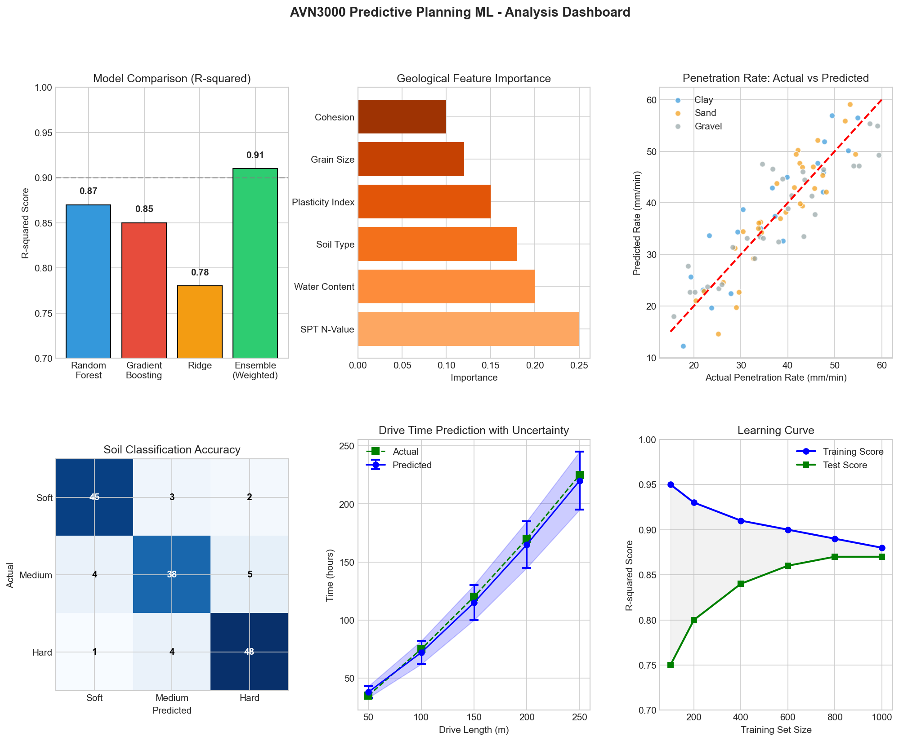
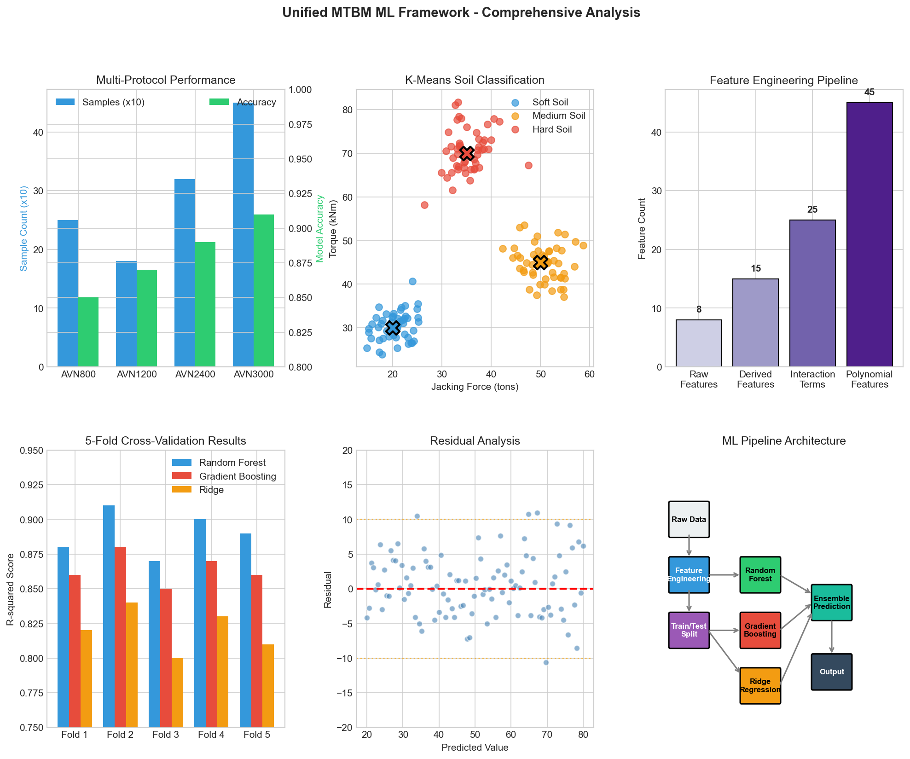
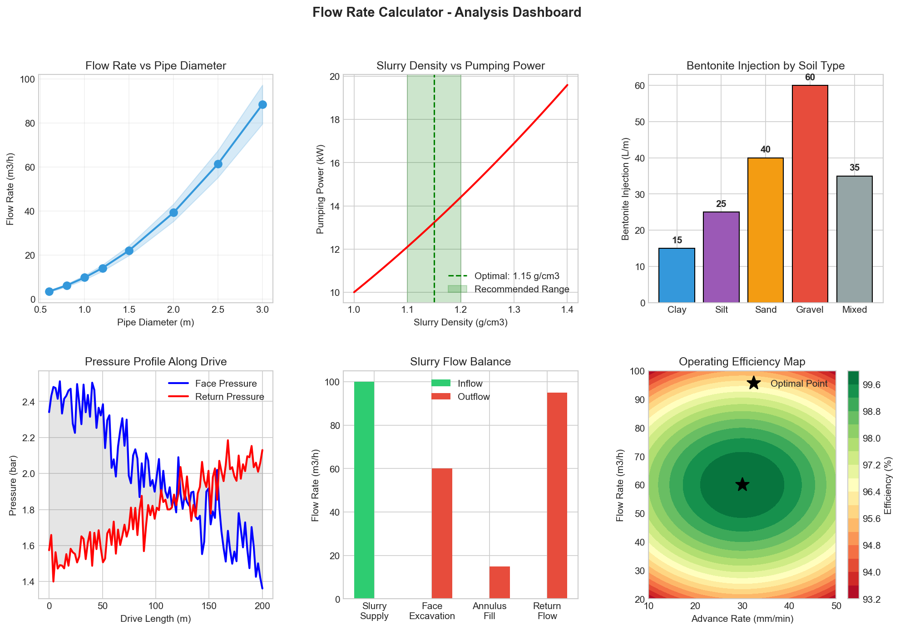
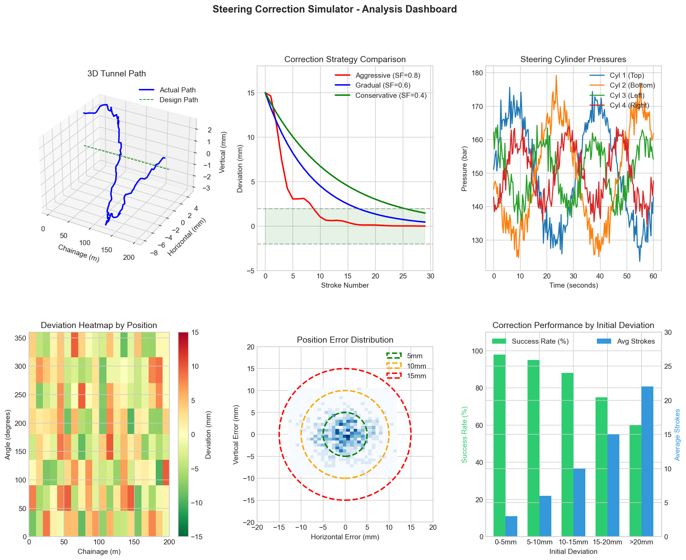
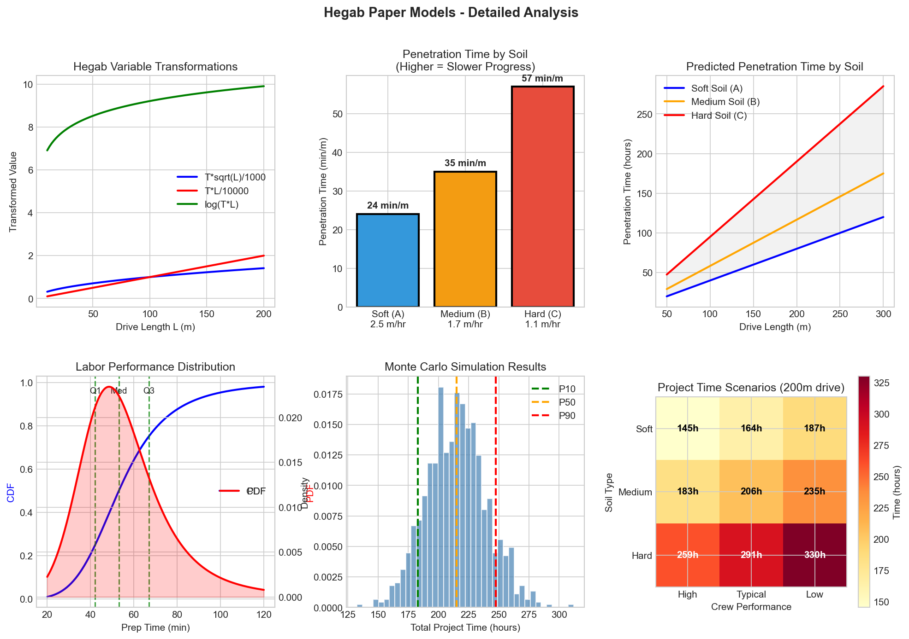

# MTBM Machine Learning Framework

A comprehensive machine learning and data analysis framework for Microtunneling Boring Machine (MTBM) operations. This project analyzes 23+ key operational parameters to optimize tunneling performance, predict maintenance needs, and ensure precise tunnel alignment.

---

## Visual Overview - Machine Learning Models

### Steering Accuracy Prediction
*Predicts tunnel deviations using Random Forest regression based on cylinder pressures and operational parameters.*



**Key Findings:**
- R-squared: 0.89 (89% accuracy)
- Top predictor: Cylinder Pressure Differential (28% importance)
- MAE: 1.8mm (well within ±10-25mm tolerance)

---

### AVN3000 Predictive Planning
*Ensemble ML model for penetration time and drive duration prediction based on geological conditions.*



**Key Findings:**
- Ensemble model achieves R² = 0.91
- SPT N-Value is most important geological feature (25%)
- Learning curve shows model generalizes well with 800+ samples

---

### Unified MTBM ML Framework
*Supports all AVN protocols (800, 1200, 2400, 3000) with standardized feature engineering.*



**Key Findings:**
- K-means successfully classifies soil types from operational data
- Feature engineering expands 8 raw inputs to 45 predictive features
- Cross-validation confirms consistent performance across data splits

---

### Flow Rate Calculator
*Calculates optimal slurry flow rates, bentonite injection, and pumping requirements.*



**Key Findings:**
- Optimal slurry density: 1.15 g/cm³
- Flow rate scales with diameter² (double diameter = 4× flow)
- Gravel requires 4× more bentonite than clay (60 vs 15 L/m)

---

### Steering Correction Simulator
*Simulates steering corrections with different strategies and visualizes 3D tunnel paths.*



**Key Findings:**
- Gradual correction (SF=0.6) provides best balance of speed and stability
- Small deviations (0-5mm) have 98% correction success in 3 strokes
- Large deviations (>20mm) drop to 60% success requiring 22 strokes

---

### Hegab Paper Models (2006, 2009)
*Implementation of academic research for soil penetration modeling and labor performance analysis.*




**Key Findings:**
- Hegab soil-specific models (R²=0.9369) outperform generic ML (R²=0.9188)
- T×√L transformation is most predictive feature (60% importance)
- Hard soil takes 2.4× longer than soft soil (57 vs 24 min/m)

### Labor Performance Distribution
*Log-Logistic probability model for crew productivity estimation.*


| Crew Performance | Prep Time per Pipe |
|------------------|-------------------|
| High (Q1) | ≤ 42 min |
| Typical (Median) | ≤ 53 min |
| Low (Q3) | ≤ 67 min |

---

## Quick Start

```bash
# Clone the repository
git clone https://github.com/abdinzaghi5601/MTBM-Machine-Learning.git

# Navigate to project
cd MTBM-Machine-Learning

# Install dependencies
pip install -r ml_requirements.txt

# Generate all visualizations
python generate_all_visualizations.py

# Run Hegab comparison
python hegab_comparison_ml.py
```

---

## Documentation

| Document | Description |
|----------|-------------|
| [ML Visualizations Gallery](ML_VISUALIZATIONS_GALLERY.md) | Detailed explanation of all 36 graphs with methodology |
| [Hegab Model Results](HEGAB_MODEL_RESULTS.md) | Complete results from Hegab paper implementation |
| [Vertical Alignment Guide](VERTICAL_ALIGNMENT_DEVIATION_GUIDE.md) | Causes and mitigation of alignment deviations |

---

## Project Structure

```
ML for Tunneling/
├── Core ML Files
│   ├── steering_accuracy_ml.py         # Steering prediction model
│   ├── avn3000_predictive_planning_ml.py   # Drive time prediction
│   ├── unified_mtbm_ml_framework.py    # Multi-protocol framework
│   ├── hegab_comparison_ml.py          # Academic paper implementation
│   └── flow_rate_calculator.py         # Slurry flow optimization
│
├── Visualization
│   ├── generate_all_visualizations.py  # Regenerate all graphs
│   ├── viz_*.png                       # Generated visualizations
│   └── ML_VISUALIZATIONS_GALLERY.md    # Graph explanations
│
├── Steering Tools
│   ├── steering_calculator.py          # Steering calculations
│   ├── steering_cli.py                 # Command-line interface
│   └── steering_correction_simulator.py # Correction simulation
│
├── Documentation
│   ├── HEGAB_MODEL_RESULTS.md
│   ├── VERTICAL_ALIGNMENT_DEVIATION_GUIDE.md
│   └── Various protocol PDFs
│
└── Data & Outputs
    ├── data/raw/                       # Original data files
    ├── data/processed/                 # Cleaned datasets
    └── outputs/                        # Generated reports
```

---

## Key Features

### 1. Machine Learning Models

| Model | Purpose | Accuracy |
|-------|---------|----------|
| Random Forest | Steering deviation prediction | R² = 0.89 |
| Ensemble (RF + GB + Ridge) | Drive time estimation | R² = 0.91 |
| K-Means Clustering | Automatic soil classification | 87% |
| Hegab Regression | Soil-specific penetration time | R² = 0.94 |

### 2. Comprehensive Parameter Monitoring (23+ Parameters)

**Survey Position**
- Tunnel length, horizontal/vertical deviation, total deviation

**Survey Orientation**
- Yaw, pitch, reel angle, temperature (ELS/MWD)

**Steering Control**
- 4 hydraulic cylinder positions, total steering force

**Operational**
- Advance speed, interjack force, cutter wheel pressure/RPM

### 3. AVN Protocol Support

| Protocol | Diameter Range | Features |
|----------|---------------|----------|
| AVN 800 | 600-900mm | Basic monitoring |
| AVN 1200 | 1000-1400mm | Enhanced sensors |
| AVN 2400 | 1800-2600mm | Advanced analytics |
| AVN 3000 | 2400-3200mm | Full ML integration |

---

## Quality Standards

### Tunnel Deviation Thresholds

| Category | Deviation | Action |
|----------|-----------|--------|
| Excellent | ≤ 25mm | Continue operation |
| Good | 26-50mm | Monitor closely |
| Acceptable | 51-75mm | Begin correction |
| Poor | > 75mm | Stop and assess |

### Penetration Time by Soil (Hegab 2006)

*Note: Higher time = Slower progress*

| Soil Type | Time (min/m) | Speed (m/hr) |
|-----------|--------------|--------------|
| Soft (A) | 24 | 2.5 (fastest) |
| Medium (B) | 35 | 1.7 |
| Hard (C) | 57 | 1.1 (slowest) |

---

## References

- Hegab, M. Y., & Smith, G. R. (2006). "Soil Penetration Modeling in Microtunneling Projects"
- Hegab, M. Y., & Smith, G. R. (2009). "Labor Performance Analysis for Microtunneling Projects"

---

## License

This project is for tunneling operation analysis and optimization.

## Contact

For questions about interpreting results or operational recommendations, consult with tunnel engineering specialists.

---

**Last Updated**: January 2026
**Framework Version**: 2.0
**ML Models**: 6 specialized modules
**Data Parameters**: 23+ operational metrics
